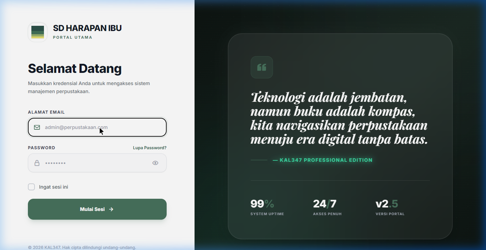
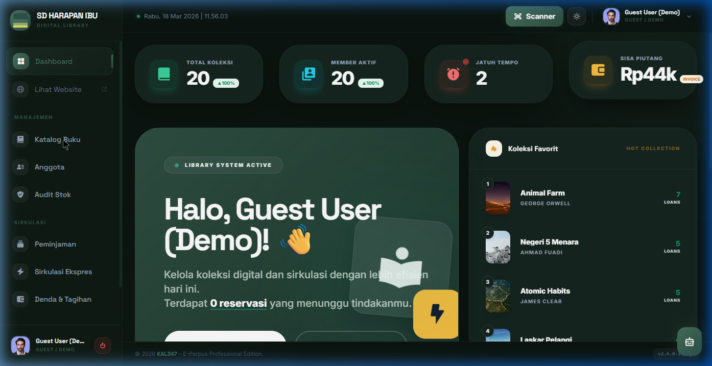
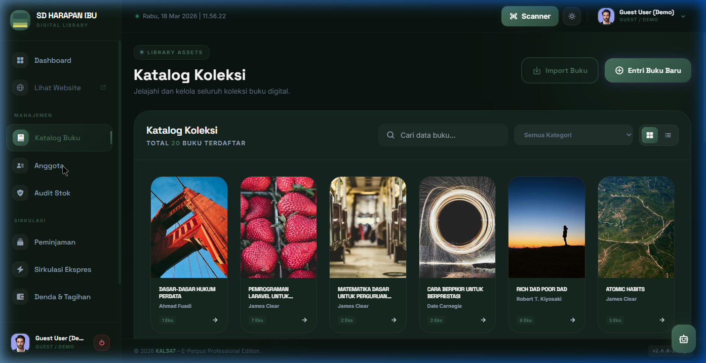
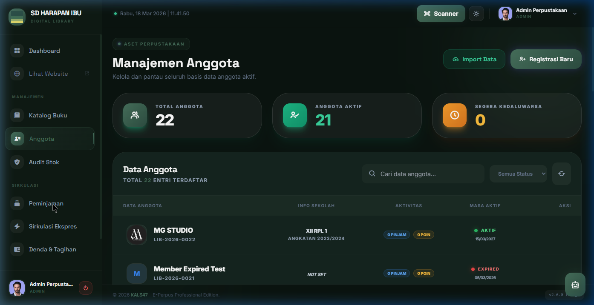

<div align="center">

<h1>📚 LibraFlow — Ubah Perpustakaan Manual Jadi Sistem Digital dalam 1 Hari</h1>

<p><em>Solusi lengkap untuk mengelola buku, anggota, dan peminjaman secara otomatis — tanpa ribet</em></p>


<br/>

> ❌ Masih catat peminjaman di buku tulis?  
> ❌ Sering kehilangan data atau telat tracking?  
>
> **LibraFlow bantu otomatisasi semuanya — cepat, rapi, dan profesional.**

<br/>

### 🚀 Coba Demo Sekarang (Tanpa Install)

👉 [**Akses Link Live Demo**](https://web-production-d6a51.up.railway.app/)

| Role | Email | Password |
|------|-------|----------|
| 🧑‍💼 Demo | demo@perpus.com | percobaan123 |

> ⚡ Langsung pakai di browser — tidak perlu setup dan register riweh.

</div>

---

## 🏆 Kenapa Pilih LibraFlow?

- ⚡ **Siap pakai** — tidak perlu *develop* pusing-pusing dari nol  
- 🎯 **Tepat Sasaran** — dirancang khusus untuk operasional sekolah & kampus  
- 📊 **Sentralistik** — semua data terpusat dan mudah dipantau  
- 🔒 **Aman (RBAC)** — sistem dibatasi dengan role & akses terkontrol  
- 💡 **Scalable** — bebas dikembangkan sesuai kebutuhan instansi Anda  

---

## 🖼️ Tampilan Sistem

### 🌐 Landing Page


### 🔐 Login


### 📊 Dashboard


### 📚 Katalog Buku Digital


### 👥 Anggota


### 🔄 Peminjaman / Sirkulasi


### 💰 Penagihan & Denda


---

## ✨ Fitur Utama Tersedia

### 📚 Manajemen Buku
- ✅ CRUD buku + Cover, QR code, dan Barcode otomatis
- ✅ Import Eksemplar massal ribuan data via Excel (Cepat!)
- ✅ Modul Buku Digital bawaan (PDF Viewer online)
- ✅ Audit Stok Opname berkala

### 👥 Anggota
- ✅ Pendaftaran Siswa & Guru + Upload Foto Profil
- ✅ Sistem Poin & Badge Keaktifan (Gamifikasi Membaca)
- ✅ Catatan Riwayat Aktivitas & Pelanggaran

### 🔄 Peminjaman
- ✅ Alur Sirkulasi instan & otomatis 
- ✅ Sistem *Booking* / Reservasi buku idaman
- ✅ Tracking status jatuh tempo *real-time*

### 💰 Denda
- ✅ Kalkulasi kalkulator denda otomatis terpusat
- ✅ Tarif dan denda per hari bisa Anda rubah sebebasnya
- ✅ Histori tagihan dan lunas

### 📊 Laporan
- ✅ Dashboard Statistik super gokil dan interaktif
- ✅ Unduh laporan PDF / Excel untuk kepala sekolah
- ✅ Grafik Tren membaca bulanan

### ⚙️ Sistem
- ✅ Multi Role: Admin, Pustakawan, Guest, Anggota Siswa
- ✅ Log Aktivitas setiap detik 
- ✅ Request Pembelian Buku oleh Anggota

---

## 💼 Sangat Cocok Untuk:

- 🏫 **Tingkat Sekolah (SD, SMP, SMA/SMK)**
- 🎓 **Perguruan Tinggi / Universitas**
- 🏡 **Perpustakaan Desa & Komunitas Taman Baca**
- 🏢 **Instansi Kantor & Swasta**

---

## 💰 Ingin Memiliki Sistem Ini? (Tersedia Jasa Penuh)

Software ini adalah produk premium Proprietary. Bagi Anda yang tidak ingin pusing coding, staf kami menyediakan:
- ✅ **Source Code Full System** (Khusus untuk Developer)
- ✅ Instalasi & *Setup* server hingga *Online* (Terima Beres)
- ✅ Modifikasi Custom Fitur menyesuaikan *Standard Operational Procedure* instansi Anda
- ✅ Pendampingan dan *Support Maintenance* bulanan

📩 **Hubungi Segera (Fast Response):**
- 📱 **WhatsApp:** [+62 851-6942-4124](https://wa.me/6285169424124)
- 📧 **Email:** [kalpin347@gmail.com](mailto:kalpin347@gmail.com)

> 🚀 **Kami siap bantu meroketkan digitalisasi perpustakaan di sekolah/instansi Anda!**

---

## ⚙️ Instalasi (Khusus Developer / Programmer)

**Anda programmer yang membeli Source Code ini? Ini buktinya betapa manjanya setup proyek ini di lokal!** 

Tak perlu lagi pusing mikirin konfigurasi *database*, migrasi manual, sampai instal *keys*. Cukup jalankan **1 baris perintah ajaib**, kamu bisa langsung *coding* sambil ngopi. ☕

### ⚡ Mode Kilat (One-Click Setup)

```bash
composer run setup
```
*✨ Booom! Perintah sakti di atas bakal meminjamkan tangan ghaib untuk:*
1. Mengangkut semua *dependency* inti (PHP Vendor & Node.js).
2. Meracik resep rahasia di file `.env`.
3. Menjalankan migrasi & *seeding* otomatis (Ratusan buku, kategori, & akun admin langsung terisi!).
4. Melakukan kompilasi *asset* UI (TailwindCSS) secara paripurna.
5. Mendirikan *localhost web-server*!

*Hanya butuh sekedipan mata, dan Anda bisa sapa hasilnya di browser!*

---

### 🐳 Mode Docker (Container Ready)

Kamu tipe yang malas mengotori OS fisik dengan MySQL dan servis PHP menumpuk? Docker *ready* sudah menunggumu:

```bash
docker compose up -d
docker exec -it perpustakaan-app php artisan migrate --seed
```
*Tidur nyenyak! Aplikasi super ngebut langsung on di `http://localhost:8000` tanpa bentrok port lokal.*

---

<div align="center">

**Dibuat dengan ❤️ & Semangat Kopi menggunakan Laravel 12**

⭐ Jika kamu merasa pameran UI/UX proyek ini menarik, jangan malu untuk **beri Bintang (Star)** di pojok atas ya!

</div>
