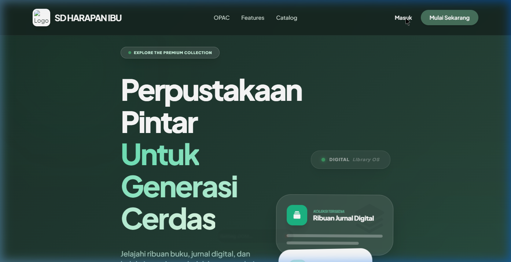

<h1>📚 LibraFlow — Sistem Manajemen Perpustakaan Modern</h1>

<em>Solusi digital lengkap untuk perpustakaan sekolah, kampus, dan institusi — dibangun dengan Laravel 12</em>

 

> ⚠️ **PEMBERITAHUAN:** Repositori ini **HANYA BERISI PREVIEW & SCREENSHOT** sebagai display portofolio dan demo. Source code **tidak dibagikan ke publik** karena proyek ini dikomersilasi (dijual).
> 
> **🎯 Dirancang untuk sekolah, kampus, dan perpustakaan umum yang ingin go digital dengan tampilan modern dan fitur lengkap.**

 

### 🌐 [👉 Coba Demo Live Sekarang](https://web-production-d6a51.up.railway.app/)

| Role | Email | Password |
|------|-------|----------|
| 🧑‍💼 **Guest / Demo** | demo@perpus.com | percobaan123 |

---

## 🖼️ Screenshot

### 🌐 Landing Page

### 🔐 Halaman Login

### 📊 Dashboard Admin

### 📚 Katalog Koleksi Buku

### 👥 Manajemen Anggota

---

## ✨ Fitur Unggulan

### 📖 Manajemen Koleksi Buku
- ✅ CRUD buku dengan **cover, barcode, dan QR code** otomatis
- ✅ Manajemen **eksemplar buku** (book copies) per item
- ✅ Kategorisasi buku, penulis, dan penerbit
- ✅ **Import buku massal** via file Excel
- ✅ Tandai buku sebagai **featured / unggulan**
- ✅ Dukungan **buku digital (PDF)** yang bisa dibaca langsung di browser
- ✅ **Audit stok** buku secara berkala

### 👥 Manajemen Anggota
- ✅ Pendaftaran anggota dengan **foto profil** dan data institusi (sekolah/kelas/NIS)
- ✅ **Sistem poin & badge** (gamifikasi) untuk mendorong minat baca
- ✅ Riwayat peminjaman per anggota
- ✅ Export data anggota ke Excel/PDF

### 📋 Peminjaman & Pengembalian
- ✅ Alur peminjaman yang mudah dan cepat
- ✅ **Sistem reservasi** buku (anggota bisa pesan buku sebelum tersedia)
- ✅ **Notifikasi otomatis** untuk buku yang siap diambil / hampir jatuh tempo
- ✅ Tracking status: *Dipinjam → Dikembalikan → Terlambat*

### 💰 Sistem Denda
- ✅ Kalkulasi denda otomatis berdasarkan keterlambatan
- ✅ **Pengaturan denda fleksibel** (tarif per hari, batas maksimum, dll.)
- ✅ Riwayat pembayaran denda

### 📊 Laporan & Analitik
- ✅ Dashboard dengan statistik real-time
- ✅ Laporan peminjaman, pengembalian, dan denda
- ✅ **Export laporan** ke PDF & Excel
- ✅ Grafik tren peminjaman

### ⚙️ Pengaturan Sistem
- ✅ **Pengaturan global**: nama perpustakaan, logo, kontak
- ✅ Manajemen staff dengan **role-based access** (Admin, Staff, Guest, Siswa)
- ✅ **Pengumuman** untuk anggota
- ✅ **Activity log** setiap aksi yang dilakukan pengguna
- ✅ **Sistem request buku** dari anggota ke pustakawan

### 🌐 Halaman Publik
- ✅ **Landing page** menarik dengan pencarian buku
- ✅ **Katalog online** yang bisa diakses tanpa login
- ✅ Kartu anggota digital dengan **QR Code**

### 🔒 Keamanan & Akses
- ✅ Sistem **RBAC** (Role Based Access Control) dengan Policy Laravel
- ✅ Role: **Admin**, **Staff**, **Guest**, **Siswa**
- ✅ Proteksi route dan validasi di setiap endpoint

---

## 🛠️ Tech Stack

| Layer | Teknologi |
|-------|-----------|
| **Backend** | Laravel 12, PHP 8.2+ |
| **Frontend** | Blade Templates, Tailwind CSS, Vite |
| **Database** | MySQL / SQLite |
| **PDF / Barcode** | DomPDF, PHP Barcode Generator, Simple QRCode |
| **Excel** | Maatwebsite Excel (Import/Export) |
| **Image Processing** | Intervention Image |
| **Containerization** | Docker + Docker Compose |
| **Queue** | Laravel Queue (Database Driver) |
| **Caching** | Laravel Cache (File/Redis) |

---

## 🛒 Cara Mendapatkan Source Code

Karena proyek ini adalah produk premium, **source code lengkap (Backend + Frontend + Database)** tidak di-publish di GitHub public. 

Jika Anda tertarik untuk membeli kode sumber sistem ini (untuk dipakai di instansi Anda, studi kasus kampus, maupun dikembangkan lagi), silakan hubungi pengembang melalui:

* 📱 **WhatsApp:** [+62 851-6942-4124](https://wa.me/6285169424124)
* 📧 **Email:** [kalpin347@gmail.com](mailto:kalpin347@gmail.com)

**Apa yang akan Anda dapatkan dari pembelian?**
1. Source Code Full Version (Laravel 12).
2. Panduan instalasi dan deployment ke Server/Hosting.
3. Hak pemakaian untuk instansi atau pengembangan lanjutan.
4. *Support* instalasi pertama kali.

---

**Dibuat dengan ❤️ menggunakan Laravel 12**

⭐ Jika suka dengan UI/UX proyek ini, jangan lupa **beri bintang (Star)** di repositori ini!

